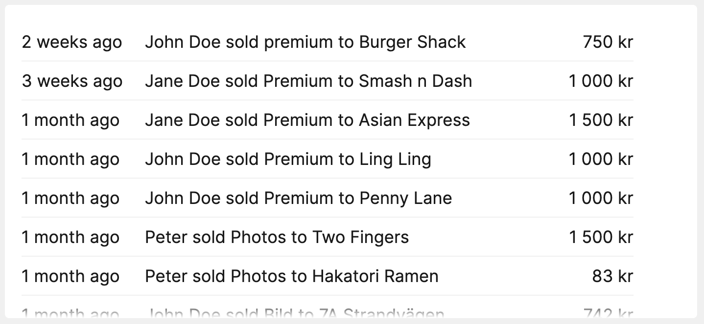
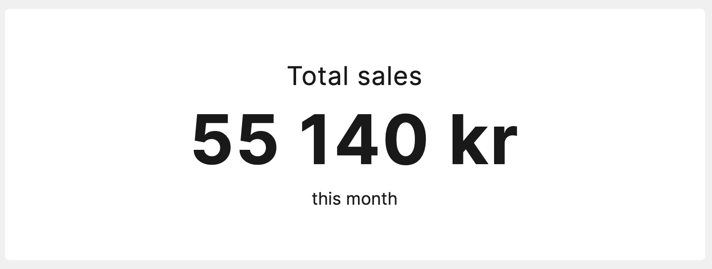

# Tile for Upsales CRM

[](https://packagist.org/packages/robbens/laravel-dashboard-upsales)
[](https://github.com/robbens/laravel-dashboard-upsales/actions?query=workflow%3Arun-tests+branch%3Amaster)
[](https://packagist.org/packages/robbens/laravel-dashboard-upsales)

Tiles for [Laravel Dashboard](https://docs.spatie.be/laravel-dashboard) that shows total and latest [Upsales](https://www.upsales.com/) data.





## Installation

You can install the package via composer:

```bash
composer require robbens/laravel-dashboard-upsales
```

## Usage

In your dashboard view.

```html
<x-dashboard>
    <livewire:upsales-total-sales-tile position="a1:b1" this-month />
    <livewire:upsales-latest-sales-tile position="a2:b3" limit="15" />
</x-dashboard>
```

Configure `config/dashboard.php`.

How to generate a token can be found [here](https://support.upsales.com/hc/en-us/articles/360010164973-Generating-an-API-Key).

```php
[
    // ...
    'tiles' => [
        'upsales' => [
            'token' => 'xxxxxxxxxxxx',
            'total-sales' => [
                'from-date' => \Carbon\Carbon::now()->firstOfMonth(), // Date in the past to fetch data from. Must be a Carbon instance
            ],
            'latest-sales' => [
                'from-date' => \Carbon\Carbon::now()->subDays(30), // Date in the past to fetch data from. Must be a Carbon instance
            ]
        ],
    ]   
]
```

Schedule the command in `app/Console/Kernel.php`.

```php
protected function schedule(Schedule $schedule)
{
    $schedule->command(\Robbens\UpsalesTile\FetchLatestSalesFromUpsalesCommand::class)->everyMinute();
    $schedule->command(\Robbens\UpsalesTile\FetchTotalSalesFromUpsalesCommand::class)->everyMinute();
}
```

## Testing

``` bash
composer test
```

## Changelog

Please see [CHANGELOG](CHANGELOG.md) for more information on what has changed recently.

## Contributing

Please see [CONTRIBUTING](CONTRIBUTING.md) for details.

## Security

If you discover any security related issues, please email yo@robin.se instead of using the issue tracker.

## Credits

- [All Contributors](../../contributors)

## License

The MIT License (MIT). Please see [License File](LICENSE.md) for more information.
